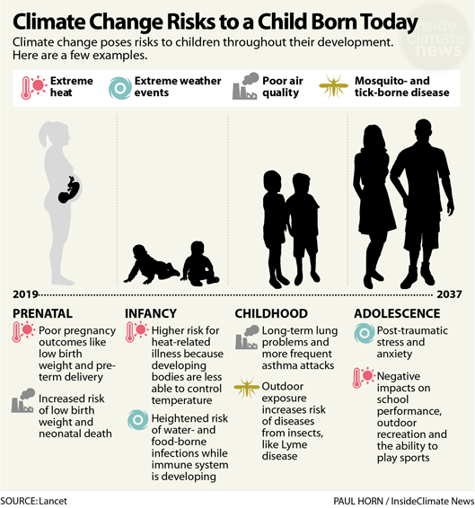

```{r setup, include=FALSE}
knitr::opts_chunk$set(echo = TRUE, fig.align="center")

library(tidyverse)
library(leaflet)
library(maps)
library(mdsr)
library(readr)
library(dplyr)
library(janitor)
library(countrycode)
library(tabulizer)
library(plotly)
library(ggplot2)
library(gganimate)
library(gifski)
library(shiny)
library(shinythemes)
library(shiny)

path_mythili <- "C:/Users/seshu/Documents/RStudio/projects/git/Blog-HealthAndJusticeLeague/data"
path_bella <- "C:/Users/Bella/Desktop/git/Blog-HealthAndJusticeLeague/data"
path_lillian <- "C:/Users/Yesuel Kim/Documents/Git/Blog-HealthAndJusticeLeague/data"

######### fixme: change this before you run the code! ###########

my_path <- path_bella
```

## Beyond Global Warming

Social justice, by definition, considers justice in terms of rights, opportunities, and privileges within a society, on a regional, national, or international level. The idea behind social justice is that everyone has an innate value as human beings, and no person’s value is more or less than anyone else’s. These rights and opportunities include seemingly basic necessities of a person today, such as access to healthcare, food, and safe spaces to live.

While there are a variety of different social justice issues worldwide, some of them are more relevant and prevalent depending on the region you're talking about. As these issues are often broad and diverse, we would like to focus on a single, seemingly less prevalent, factor that may have been affecting people's quality of life on a global scale to varying degrees: **environmental change**. 

In 2019, the United Nations Foundation listed climate change as the top global issue to watch, as global emissions of greenhouse gases have been consistently rising since the early 2000s. This rise has partially contributed to the global temperature increase over time (1880-2020) that we have seen over time (see figure below).

```{r, echo = FALSE, eval = FALSE}
# App.R file of this shiny app is in
# Blog-HealthAndJusticeLeague>shiny>globaltemperature
```

<iframe height="600" width="100%" frameborder="no" title="Increase in Global Temperature" src="https://lillianykim.shinyapps.io/globaltemperature/"> </iframe>


Climate change, and this temperature increase, can affect the future prevalence and intensity of various climate disasters. These effects include a higher risk of droughts and possibly floods (due to less frequent, but more intense precipitation). Furthermore, the temperature increase worldwide can bring the temperatures at the north and south poles, closer to that of the equator. The temperature increase will make the poles hotter and more humid, which in fact could reduce the number of storms. But this sounds like a good thing, right? Unfortunately, as land surface temperatures, humidity, there is more water vapor present in the atmosphere, so the intensity of the storms, as well as the domain of occurrence for certain tropical storms, could increase. Furthermore, these rising land and sea surface temperatures are causing glacial melting, which increases the sea levels and thus can increases the extent of coastal flooding (*Climate Insights 2020: Natural Disasters*, *The Impact of Climate Change on Natural Disasters*).

Given this information, we wondered whether climate change could be considered as one of the aforementioned social justice issues, and whether it is disproportionately related to quality of life in different parts of the globe. However, considering the effects of climate change as a whole on society is a hefty task. Instead, we investigated the ripple effects of air quality and the prevalence of climate disasters, on a community's public health. Public health, in relation to these environmental events, was looked at through three different lenses, as described in the questions below:

### Research Questions

1. Are the effects of climate change (specifically air pollution) evident in epidemiological prevalence data or mortality data?

2. How do climate change ripple effects (measured via infant and maternal mortality) show differently in developing (i.e. more agriculture-based) versus developed countries?

3. How has the impact of natural disasters changed over time? How many people have been affected by these climate disasters?


# Are environmental issues evident in epidemiological prevalence data or mortality data? (BH)

We are often poised to think of air pollution as one of the most apparent environmental issues around the world today, as we hear about the emission of pollutants and chemicals from various technology and industry.  Therefore, we chose to investigate air quality and whether its impact is evident in global health. 

Exposure to PM 2.5 (µg/m^3^) | Disability-adjusted life years (DALY)
------------------------------------ | ------------------------------------
The concentration level to which a typical resident is exposed throughout a year.     | Years lost due to exposure to environmental-related risks per 1000 inhabitants


Our measure of air quality is **exposure to ambient particulate matter (PM2.5)**, a type of air pollutants. In particular, our variable indicates the mean population exposure to outdoor PM2.5, calculated as the mean annual outdoor PM2.5 concentration weighted by population living in the relevant area, that is, the concentration level, expressed in ug/m^3^ to which a typical resident is exposed throughout a year. 

We then chose to look at morbidity as our measure of people’s health affected by air quality. Specifically, this variable measures the **disability-adjusted life years (DALY)**, which are calculated as the number of years lost due to exposure to environmental-related risks, expressed in absolute value, per 1000 inhabitants. DALYs are defined as the sum of years of potential life lost due to premature mortality and the years of productive life lost. Both the exposure to PM2.5 and DALY data were collected and released by the OECD; the details of the methods can be found at the end of the report. 

> Given the information in the overview, we hypothesized that while the changes in exposure to PM2.5 and DALY are positively correlated, these changes will most likely be indicative of the ongoing climate change and global warming. That is, the air quality would have worsened over the years. 

## Investigation on Air Quality through Leaflets

To visualize our data, we chose to create a series of choropleths that display the level of exposure to particulate matter and the number of years lost due to this exposure in each country around the world. The following two choropleths show PM2.5 exposure in 1990 and 2017, respectively. We chose to create leaflets to allow for interactivity of hovering over or selecting a particular country. 

To help with the understanding of this measure, we will provide a few examples in context. When a user selects the country Brazil by clicking on it on the leaflet showing the data for 1990, a value of 15.402 µg/m^3^ will be displayed as the PM2.5 measure. This means that the mean annual outdoor PM2.5 concentration is 15.402 µg/m^3^, and this value is also weighted, or standardized, by population. As another example, Saudi Arabia displays a value of 92.368 µg/m^3^ on the leaflet showing data for 2017. Based on the PM2.5 guideline provided by the World Health Organization, Brazil in 1990 is considered to be in a moderate range of PM2.5, while Saudi Arabia is in a highly dangerous range. Despite such great differences in the PM2.5 level in different countries, these two choropleths show that the air quality in general has improved over the years from 1990 to 2017. This change is most noticeable in many countries in the Eastern Europe, Latin America, and Southern Africa, while there are several countries undergoing a similar change in parts of Asia. 

```{r, echo = FALSE, message = FALSE, warning = FALSE, include = FALSE}
data_air <- read_csv(paste0(my_path, "/wrangled_air_final.csv."))
data_DALY <- read_csv(paste0(my_path, "/wrangled_DALY_final.csv."))
data_joined <- read_csv(paste0(my_path, "/joined_air_DALY_final.csv"))
```

```{r, message = FALSE, include = FALSE, warning = FALSE}
#leaflet for PM2.5
#world_leaflet$names
world_leaflet <- map("world", unique(data_air$Country), fill = TRUE, plot = FALSE)
world_leaflet$country <- vapply(strsplit(world_leaflet$names, ":"), function(x) x[1],
                                FUN.VALUE = "a")
world_leaflet$Y1990 <- data_air$Y1990[match(world_leaflet$country, data_air$Country)]
world_leaflet$Y2017 <- data_air$Y2017[match(world_leaflet$country, data_air$Country)]
world_leaflet$change <- data_air$change[match(world_leaflet$country, data_air$Country)]

bins <- c(0, 10, 15, 25, 35, Inf)
binschange <- c(-Inf, -5, 0, 5, Inf)
pal1990 <- colorBin("YlOrRd", domain = world_leaflet$Y1990, bins = bins)
pal2017 <- colorBin("YlOrRd", domain = world_leaflet$Y2017, bins = bins)
palchange <- colorBin("PiYG", domain = world_leaflet$change, bins = binschange)

#for 1990
PM25_1990_leaflet <- leaflet(data = world_leaflet)%>%
  addTiles()%>%
  setView(0, 0, zoom = 1.5)%>%
  addPolygons(fillColor = ~pal1990(Y1990),
              weight = 1,
              opacity = 1,
              color = "white",
              dashArray = "3",
              fillOpacity = 0.7,
              highlight = highlightOptions(weight = 2,
                                           color = "#666",
                                           dashArray = "",
                                           fillOpacity = 0.7,
                                            bringToFront = TRUE),
              label = sprintf("<strong>%s</strong><br/>%g µg / m<sup>3</sup>",
                              world_leaflet$country, world_leaflet$Y1990)%>% 
                lapply(htmltools::HTML),
              labelOptions = labelOptions(style = list("font-weight" = "normal", padding = "3px 8px"),
                                          textsize = "12px",
                                          direction = "auto"),
              popup = paste0("Country: ", world_leaflet$country, "<br>",
                             "PM2.5 Value: ", round(world_leaflet$Y1990, 3), 
                             " µg / m<sup>3</sup><br>"))%>%
  addLegend(pal = pal1990, values = ~Y1990, 
            opacity = 0.7, 
            title = "PM 2.5 Measure in 1990",
            position = "bottomright")


#for 2017
PM25_2017_leaflet <- leaflet(data = world_leaflet)%>%
  addTiles()%>%
  setView(0, 0, zoom = 1.5)%>%
  addPolygons(fillColor = ~pal2017(Y2017),
              weight = 1,
              opacity = 1,
              color = "white",
              dashArray = "3",
              fillOpacity = 0.7,
              highlight = highlightOptions(weight = 2,
                                           color = "#666",
                                           dashArray = "",
                                           fillOpacity = 0.7,
                                            bringToFront = TRUE),
              label = sprintf("<strong>%s</strong><br/>%g µg / m<sup>3</sup>",
                              world_leaflet$country, world_leaflet$Y2017)%>% 
                lapply(htmltools::HTML),
              labelOptions = labelOptions(style = list("font-weight" = "normal", padding = "3px 8px"),
                                          textsize = "12px",
                                          direction = "auto"),
              popup = paste0("Country: ", world_leaflet$country, "<br>",
                             "PM2.5 Value: ", round(world_leaflet$Y2017, 3), 
                             " µg / m<sup>3</sup><br>"))%>%
  addLegend(pal = pal2017, values = ~Y2017, 
            opacity = 0.7, 
            title = "PM 2.5 Measure in 2017",
            position = "bottomright")

PM25_change_leaflet <- leaflet(data = world_leaflet)%>%
  addTiles()%>%
  setView(0, 0, zoom = 1.5)%>%
  addPolygons(fillColor = ~palchange(change),
              weight = 1,
              opacity = 1,
              color = "white",
              dashArray = "3",
              fillOpacity = 0.7,
              highlight = highlightOptions(weight = 2,
                                           color = "#666",
                                           dashArray = "",
                                           fillOpacity = 0.7,
                                            bringToFront = TRUE),
              label = sprintf("<strong>%s</strong><br/>%g µg / m<sup>3</sup>",
                              world_leaflet$country, world_leaflet$change)%>% 
                lapply(htmltools::HTML),
              labelOptions = labelOptions(style = list("font-weight" = "normal", padding = "3px 8px"),
                                          textsize = "12px",
                                          direction = "auto"),
              popup = paste0("Country: ", world_leaflet$country, "<br>",
                             "PM2.5 Value: ", round(world_leaflet$change, 3), 
                             " µg / m<sup>3</sup><br>"))%>%
  addLegend(pal = palchange, values = ~change, 
            opacity = 0.7, 
            title = "Change in PM 2.5 Meausre from 1990 to 2017",
            position = "bottomright")
```

```{r, echo = FALSE, fig.width = 8}
#PM2.5 leaflets
PM25_1990_leaflet
PM25_2017_leaflet
```

These leaflets are effectively mapping the PM2.5 level on a global scale and letting us compare the PM2.5 level between multiple countries. Though we can see some changes undergone by some countries, this change is not dramatically apparent at first sight. Therefore, we created an additional leaflet that shows the change in PM2.5 level from 1990 to 2017. The value indicates the change from 1990 to 2017 (i.e. value_1990 - value_2017), so a positive value indicates a decrease in PM2.5 level, while a negative value indicates an increase. For example, India experienced an increase in PM2.5 level of 8.558 µg/m^3^. As we expect, now more clearly, we see a positive change in air quality in general around the world. 

```{r, echo = FALSE}
PM25_change_leaflet
```

## Investigation of Mortality (DALY) through Leaflets

Similar steps were taken for the next set of choropleths focusing on the disability-adjusted life years in 1990 and 2017 around the world. Just to interpret a few observations in context, we see that people in Brazil in 1990 lost 5.77 years of potential life due to exposure to ambient PM2.5 per 1000 inhabitants, and those in Russia in 2017 lost 15.681 years. Comparing these two choropleths, we see in general a decrease in the DALY score around the world, and this trend is most apparent in countries in Eastern Europe and Africa.

```{r, include = FALSE, warning = FALSE}
#leaflet for pdeaths
world_leaflet_DALY <- map("world", unique(data_DALY$country), 
                            fill = TRUE, plot = FALSE)
world_leaflet_DALY$country <- vapply(strsplit(world_leaflet_DALY$names, ":"),
                                       function(x) x[1],
                                FUN.VALUE = "a")
world_leaflet_DALY$Y1990 <- data_DALY$Y1990[match(world_leaflet_DALY$country, data_DALY$country)]
world_leaflet_DALY$Y2017 <- data_DALY$Y2017[match(world_leaflet_DALY$country, data_DALY$country)]
world_leaflet_DALY$change <- data_DALY$change[match(world_leaflet_DALY$country, data_DALY$country)]

binschange2 <- c(-Inf, -5, 0, 5, Inf)
bins2 <- c(0, 5, 10, 15, 20, Inf)
pal1990_2 <- colorBin("YlGnBu", domain = world_leaflet_DALY$Y1990, bins = bins2)
pal2017_2 <- colorBin("YlGnBu", domain = world_leaflet_DALY$Y2017, bins = bins2)
palchange2 <- colorBin("PiYG", domain = world_leaflet_DALY$change, bins = binschange2)

#for 1990
DALY_1990_leaflet <- leaflet(data = world_leaflet_DALY)%>%
  addTiles()%>%
  setView(0, 0, zoom = 1.5)%>%
  addPolygons(fillColor = ~pal1990_2(Y1990),
              weight = 1,
              opacity = 1,
              color = "white",
              dashArray = "3",
              fillOpacity = 0.7,
              highlight = highlightOptions(weight = 2,
                                           color = "#666",
                                           dashArray = "",
                                           fillOpacity = 0.7,
                                            bringToFront = TRUE),
              label = sprintf("<strong>%s</strong><br/>%g years",
                              world_leaflet_DALY$country, world_leaflet_DALY$Y1990)%>% 
                lapply(htmltools::HTML),
              labelOptions = labelOptions(style = list("font-weight" = "normal",
                                                       padding = "3px 8px"),
                                          textsize = "12px",
                                          direction = "auto"),
              popup = paste0("Country: ", world_leaflet_DALY$country, "<br>",
                             "DALY",
                             round(world_leaflet_DALY$Y1990, 2), 
                             " per 1k <br>"))%>%
  addLegend(pal = pal1990_2, values = ~Y1990, 
            opacity = 0.7, 
            title = "DALY in 1990",
            position = "bottomright")

#for 2017
DALY_2017_leaflet <- leaflet(data = world_leaflet_DALY)%>%
  addTiles()%>%
  setView(0, 0, zoom = 1.5)%>%
  addPolygons(fillColor = ~pal2017_2(Y2017),
              weight = 1,
              opacity = 1,
              color = "white",
              dashArray = "3",
              fillOpacity = 0.7,
              highlight = highlightOptions(weight = 2,
                                           color = "#666",
                                           dashArray = "",
                                           fillOpacity = 0.7,
                                            bringToFront = TRUE),
              label = sprintf("<strong>%s</strong><br/>%g units",
                              world_leaflet_DALY$country, world_leaflet_DALY$Y2017)%>% 
                lapply(htmltools::HTML),
              labelOptions = labelOptions(style = list("font-weight" = "normal",
                                                       padding = "3px 8px"),
                                          textsize = "12px",
                                          direction = "auto"),
              popup = paste0("Country: ", world_leaflet_DALY$country, "<br>",
                             "DALY Score: ",
                             round(world_leaflet_DALY$Y2017, 3), 
                             " per 1K <br>"))%>%
  addLegend(pal = pal2017_2, values = ~Y2017, 
            opacity = 0.7, 
            title = "DALY scores in 2017",
            position = "bottomright")

#CHANGE from 1990 to 2017
DALY_change_leaflet <- leaflet(data = world_leaflet_DALY)%>%
  addTiles()%>%
  setView(0, 0, zoom = 1.5)%>%
  addPolygons(fillColor = ~palchange2(change),
              weight = 1,
              opacity = 1,
              color = "white",
              dashArray = "3",
              fillOpacity = 0.7,
              highlight = highlightOptions(weight = 2,
                                           color = "#666",
                                           dashArray = "",
                                           fillOpacity = 0.7,
                                            bringToFront = TRUE),
              label = sprintf("<strong>%s</strong><br/>%g units",
                              world_leaflet_DALY$country, world_leaflet_DALY$change)%>% 
                lapply(htmltools::HTML),
              labelOptions = labelOptions(style = list("font-weight" = "normal",
                                                       padding = "3px 8px"),
                                          textsize = "12px",
                                          direction = "auto"),
              popup = paste0("Country: ", world_leaflet_DALY$country, "<br>",
                             "DALY Score: ",
                             round(world_leaflet_DALY$change, 3), 
                             " per 1K <br>")) %>%
   addLegend(pal = palchange2, values = ~change, 
            opacity = 0.7, 
             title = "Change in DALY scores",
             position = "bottomright")
```

```{r, echo = FALSE, fig.width = 8}
DALY_1990_leaflet
DALY_2017_leaflet
```

However, a similar concern arises as before: though we are effectively showing the distribution of DALY around the world for each year, the change is not necessarily clear at first sight due to a relatively small range of values. Therefore, similar steps were taken to show the change in DALY from 1990 to 2017. Note that the change was calculated by subtracting the value in 2017 from the value in 1990 (i.e. change = DALY_1990 - DALY_2017). Therefore, a positive value on this map indicates a decrease in DALY, while a negative value indicates an increase in DALY. For example, Spain has undergone a positive change (decrease) in DALY. Consistent with the two maps created above, we see that in general the countries experience a decrease in DALY.  

```{r, echo = FALSE}
DALY_change_leaflet
```

Now, taking a few steps back to the original question we are trying to answer, notice that the two maps showing the change in PM2.5 and DALY look quite similar at a first glance. There are countries that show an opposing trend, where there is an increase in PM2.5 exposure and a decrease in DALY, and vice versa. This is not what we had hypothesized, and contrary to our background knowledge in climate change, our study shows that the air quality has actually improved over time since 1990 to 2017. This might be accounted by other factors that might not have been reflected in this study, such as noticeable improvements in medical technology that might have contributed to a decrease in DALY despite the worsened air quality. However, for the most part, the countries that have a positive change in PM2.5 also experience a positive change in DALY, so we can reasonably conclude that PM2.5, an environmental factor, is evident in and consistent with DALY, a mortality measure. 

## Supplementary Resources

### The relationship between PM2.5 and DALY through a scatterplot

The choropleths have sufficiently answered the question we wished to answer. However, a curious data scientist (like ourselves) might want to see more, perhaps what might be going on in between the two given years of 1990 and 2018, and whether the relationship between PM2.5 and DALY we have established earlier still holds true, if we were to take a look at a different time frame.

The most intuitive way to achieve this is probably to create plots that show the relationship between PM2.5 and DALY for a particular set of years, and without a Shiny app, we are almost certainly destined to make a multiple set of data visualizations, which can be exciting but also tedious and inefficient. In fact, this should be a supplementary resource, not a source of confusion or incompetence. Therefore, our solution to this is to retain the original vision to create a plot looking at how DALY changes with PM2.5, but produce these plots in a single gif file to show an animation of the change.   

In the following plot, each colored dot represents each individual country available in our data. As we proceed from 1990 to 2017, we see that the points in general move towards the bottom-left corner from the top-right corner of the plot. A noticeable exception to this happens from 2014 to 2015 (try to observe this yourself!) where many data points move towards the right side of the plot, indicating that from 2014 to 2015 there was a relatively significant increase in PM2.5 exposure in many countries around the world. This may be something that might be worthwhile to take some time to research on; this analysis indeed revealed something that we would not have been able to see if we stopped our analysis after the first part. 

```{r, message = FALSE, warning = FALSE, include = FALSE}
#is there a way to look at how both variables change in relation to one another over time,
#in a more broader term and in a single visualization?

g <- ggplot(data_joined, aes(PM25exposure , DALY, color = country))+
  geom_point(alpha = 0.7, show.legend = FALSE)+
  scale_size(range = c(2, 12))+
  theme_classic()+
  theme(
        rect = element_rect(fill = "transparent")
      )+
  labs(title = 'Year: {round(frame_time, 0)}', x = 'PM 2.5', y = 'DALY per 1K')+
  transition_time(year)+
  ease_aes('linear')
```

```{r, message = FALSE}
animate(g, duration = 20, fps = 20, width = 400, height = 400, renderer = gifski_renderer())
#anim_save("PM2.5 vs. DALY.gif")
```

### What actually happened in between the years 1990 and 2017 (Line Plot)? 

Now, with those in mind, an even more curious data scientist might want to see how either PM2.5 and DALY change for a particular country over a period of time that is not established through the choropleths. That is, a line graph or a similar sort where the x axis represents the year and the y axis represents either PM2.5 or DALY. This would be something that would be achieved most effectively and efficiently through shiny app’s interactivity: there are approximately 200 countries in the world (and in this data) and to display all of these countries at once would be unconventional. However, instead of making an extensive shiny app, we created a sample set of two line graphs that each show PM2.5 and DALY change over the years for a set of 10 randomly selected countries(using `runif()`). We had done this because we did not want to put an equal or greater amount of coding efforts to something that is not the main tool to be used to achieve the original purpose, but still leave room for further investigation. 

The following two interactive line graphs show the change in DM2.5 and DALY from 1990 to 2017. This is similar to the earlier change leaflets we had displayed but different in that these show all the values for a country in a given year and that these don’t account for the rest of approximately 190 countries. Therefore, we will not make a particular analysis on these visualizations, as our analysis will not account for the entirety of the data. Please consider these as simply a supplemental resource to make a similar analysis we made in order to answer our original question with an additional capability to observe the variables in a given year between 1990 and 2017.

```{r, message = FALSE, warning = FALSE}
#generate a list of randomly selected 10 countries
countrylist_index <- floor(runif(10, min = 0, max = nrow(data_joined)))
countrylist <- rep(c("country"), 10)

for (i in 1:length(countrylist_index)){
  countrylist[i] <- data_joined$country[countrylist_index[i]]
}

data_joined <- subset(data_joined, country %in% countrylist)
```

```{r, message = FALSE, warning = FALSE, echo = FALSE}
#plot DALY using the randomly chosen 10 countries
gdaly <- ggplotly(ggplot(data = data_joined, mapping = aes(x = year, y = DALY, color = country)) +
    geom_line() +
  scale_y_continuous(trans = "log10")+
    labs(
      title = "Disability-Adjusted Life (DALY) Year per 1K inhabitants",
      subtitle = "1990 to 2017",
      y = "DALY (Years)",
      x = "Year")+
    theme_classic())

#plot PM2.5 exposure using the randomly chosen 10 countries
gexposure <- ggplotly(ggplot(data = data_joined, mapping = aes(x = year, y = PM25exposure, color = country)) +
     geom_line() +
     labs(
       title = "Population exposure to PM 2.5",
       subtitle = "1990 to 2017",
       y = "Exposure to PM2.5 (m<sup>3</sup>) ",
       x = "Year")+
    theme_classic())
```

```{r, echo = FALSE}
gexposure
gdaly
```

## Next Steps

As seen in our analysis using the choropleths, we had found that in general there seems to be a direct relationship between the change in air quality and mortality across countries. That is, an environmental factor can be evident in, and thus have directly impacted, the quality of life of the people. This being said, we wondered narrow down our focus to investigate whether an environmental factor could *disproportionately* affect *countries around the world*. Therefore, in the next section of this blog post, we will aim to answer the following question: **"Are developing countries affected differently than developed countries by climate disasters?"**

# Do climate change ripple effects (measured via infant and maternal mortality) vary from region-to-region? (MS)

When we think of climate change, and climate disasters, maternal and infant mortality are probably not the first phrases we associate with it. However, it turns out that there is a logical association between the two. This question was inspired by the Barbier, et. al. 2018 paper on *The Impacts of Climate Change on the Poor in Disadvantaged Regions*. The research paper described two categories for areas in developing countries: less-favored agricultural areas (LFAAs) and low-elevation coastal zones (LECZs). Not surprisingly, the LFAAs can be affected by changes to the terrain, soil, and overall precipitation, while LECZs, due to their coastal location, are more vulnerable to rises in the sea level, tropical storms, etc. Now we can see more clearly that climate disasters, such as flooding, storms, droughts, etc., could disproportionately affect rural areas in developing countries compared to developed countries. Changes in climate, looked at here via climate disaster occurrence, pose threats to both the agricultural productivity and the resources of such developing communities. A secondary effect of such rural poverty is that on **infant and maternal mortality rates.**

## Infant and Maternal Mortality from 1980-2018

First, let's consider how the distribution of countries' infant and maternal mortality rates have changed over the years. Although more recent, even in the 1980s, we did not possess all the current medicine and technology we have today, especially medically related. The data on infant and maternal mortality that we used came from the OECD. **Infant mortality** was categorized by no minimum threshold of gestation period or birthweight, and recorded in terms of deaths per 1,000 live births. **Maternal mortality** was recorded in terms of deaths per 100,000 live births.  

Infant mortality        | Maternal mortality       
--------------------- | -----------------------
Deaths per 1,000 live births | Deaths per 100,000 live births

In the figures below, I used the `kmeans()` function to cluster the data points of 36 countries. These figures show standardized values for the infant and maternal mortality values of 36 countries and clusters them so as to minimize within-cluster variation. We can take the clusters on the higher end of both scales to be developing countries, on the lower end to be developed, and clusters in the middle to represent countries along the spectrum of development. Each country appears as one point whose position represents its average infant/maternal mortality standardized value (over the decade).

We can see that without looking at specific countries, there is a trend of decreasing infant and maternal mortality. In the 1980s, 23 countries were in our self-labeled "Developing" cluster (between standardized values of around -1 to 0), while in the 2010s, 31 countries are in the "Developing" cluster (note the range has increased from -1 to 1).


```{r, warning = FALSE, message = FALSE}

## 1980s Cluster

#loading data
data_cluster1980s <- read_csv(paste0(my_path,"/wrangled_infmatmortcluster1980s.csv")) %>%
  mutate_at(c("avginfmort", "avmatmort"), funs(`std`=scale(.) %>% as.vector()))

#making cluster reproducible, setting number of clusters
set.seed(23)
km_out <- kmeans(data_cluster1980s[,c("avginfmort_std", "avmatmort_std")], centers = 3, nstart=20)

# add cluster assignment to the data frame
cluster1980s <- data_cluster1980s %>%
  mutate(clust = as.character(km_out$cluster))

```

```{r, warning = FALSE, message = FALSE, echo = FALSE}

# visualize the cluster assignments and centroids
ggplot(data = cluster1980s, aes(x = avginfmort_std, y = avmatmort_std)) + 
  geom_point(aes(color = clust)) +
  coord_fixed() +
  geom_point(data = as.data.frame(km_out$centers)
             , aes(x = avginfmort_std, y = avmatmort_std)
             , pch = "X"
             , size = 4) +
  theme_classic()+
  labs(x = "Standardized Average Infant Mortality"
       , y = "Standardized Average Maternal Mortality", title = "Infant and Maternal Mortality in the 1980s"
       , color = "Cluster Assignment")

```

```{r, warning = FALSE, echo = FALSE, message = FALSE}

## 2010s Cluster

#loading data
data_cluster2010s <- read_csv(paste0(my_path, "/wrangled_infmatmortcluster2010s.csv")) %>%
  mutate_at(c("avginfmort", "avmatmort"), funs(`std`=scale(.) %>% as.vector()))

#making cluster reproducible, setting number of clusters
set.seed(23)
km_out <- kmeans(data_cluster2010s[,c("avginfmort_std", "avmatmort_std")], centers = 3, nstart=20)

#vector of cluster assignments
#km_out$cluster

# add cluster assignment to the data frame
cluster2010s <- data_cluster2010s %>%
  mutate(clust2 = as.character(km_out$cluster))

# visualize the cluster assignments and centroids
ggplot(data = cluster2010s, aes(x = avginfmort_std, y = avmatmort_std)) + 
  geom_point(aes(color = clust2)) +
  coord_fixed() +
  geom_point(data = as.data.frame(km_out$centers)
             , aes(x = avginfmort_std, y = avmatmort_std)
             , pch = "X"
             , size = 4) +
  theme_classic() +
  labs(x = "Standardized Average Infant Mortality"
       , y = "Standardized Average Maternal Mortality" 
       , title = "Infant and Maternal Mortality in the 2010s"
       , color = "Cluster Assignment")

```


What's interesting here is that although we would expect a stark change in infant/maternal mortality values over time, we see more nuanced changes. The "Developing" cluster increases in size and range of values covered, while the "Middle" cluster is much more distinct and widespread than in the 1980s. We also still have one country (Mexico) that seemingly hasn't changed in terms of standardized values. It is likely that from 1980s to the 2010s, the mean infant and maternal mortality rates greatly improved, but the distribution and distinction between various country groupings (such as "Developed", "Middle", and "Developing") has stayed fairly consistent. If infant mortality and maternal mortality all improved to the same standard, we would expect to see all countries in the "Developed" cluster. However, instead we see a larger "Developed" cluster, and blatant countries that have been left behind so to say, in terms of their infant and maternal mortality rates. All countries displayed reduction in infant/maternal mortality rates from the 1980s to 2010s. This can be better seen when looking at yearly values in the data set (refer to OECD citation in Works Cited Tab). However, from these clusters alone, we can draw our first conclusion, that not all countries have reached the same infant/maternal mortality rates. **There is still a disparity in mortality rates for different countries.**

Note that the data we used only had information on countries in North and South America, Australia, and parts of Europe. Many of the more predominant developing countries and agriculturally-based societies, such as in Africa and South/Southeast Asia did not have data.

## What does Yearly Change in Infant and Maternal Mortality Look Like?

Let's zoom in to look at how infant mortality changes yearly for a pair of countries. Looking at the interactive graphs below, consider Switzerland, the second most developed nation as of 2020, according to life expectancy, economic competitiveness, infrastructure, GDP per capita ([Developed Countries List 2020](https://www.worldpopulationreview.com/country-rankings/developed-countries.)). Switzerland's economy is based more in the service sector. Compare this to Mexico, which is less developed industrially, has more widespread poverty, and is a more agriculturally-based society. We know that Mexico would has higher infant and maternal mortality rates, compared to Switzerland (can be seen in original data tables). Specifically, Mexico started at 54.8 infant deaths per 1,000 live births in 1980 and decreased to 12.9 deaths per 1,000 live births in 2018. Switzerland started at 9.1 infant deaths per 1,000 live births in 1980 and decreased to 3.3 infant deaths per 1,000 live births in 2018. Thus, we can see that even in 1980, there was a great disparity in starting point and end point, however by 2018, the gap was greatly decreased. Now if we look at the yearly changes, we can understand how Mexico has much greater negative net changes in infant mortality. Note, I chose to focus the timeline on more recent years so that there is less impact from technological advancements in medicine. There is only one year (2017) in which Mexico displays a positive net change in infant mortality. Switzerland on the other hand, while having negative net change in infant mortality between 2010 and 2018, has less frequent changes that are of lesser magnitude. In several years, the infant mortality rate stays the same. It also displays a positive net change in infant mortality in 2013. So it seems that in this case, the more agriculturally-based society has had a larger improvement in infant mortality rates than the classified Developed Country due to their largely varying starting points.

```{r, echo = FALSE, eval = FALSE}
# App.R file of this shiny app is in
# Blog-HealthAndJusticeLeague>shiny>question3
```

<iframe height="950" width="100%" frameborder="no" title="Relationship BetweenInfant and Maternal Mortality and Natural Disaster Occurrence" src="https://mysubb.shinyapps.io/InfMatMortNatDisast/"> </iframe>

Now let's look at maternal mortality for those same two countries. We can note that the magnitude of net changes in maternal mortality are much less than that of infant mortality for both Mexico and Switzerland (compare the y-axis scale of -0.5 to 0.5 for infant mortality, and -5 to 5 for maternal mortality.) We should also note again that maternal mortality is measured in terms of 100,000 live births while infant mortality is measure din terms of 1,000 live births. We can see from the graphs that for Mexico, in most years, there is a decrease in maternal mortality (equal to or greater than the decreases experienced by Switzerland yearly). Switzerland, on the other hand, has a positive net change in maternal mortality in 4 out of the 8 years displayed, and these increases are greater than that experienced by Mexico. This might indicate that it is not random variation in maternal mortality, but there might be an added factor specific to Switzerland contributing to these increases between 2012 and 2017. This is contrary to our understanding of how developed Switzerland is in terms of life expectancy, access to health care, etc., but is a trend that was also noticed in infant mortality rates around 2011 (Wanner, et. al. 2017). From 2010 to 2017, Mexico's maternal mortality dropped from 43.7 to 35 deaths per 100,000 live births, while Switzerland's increased from 3.7 - 4.6 deaths per 100,000 live births. So what can we conclude from this? Surprisingly, the graphs of these two countries indicates that although Switzerland is more developed and thought to have better healthcare, their maternal mortality actually increased in the past decade, while Mexico's mainly decreased. So again we see a stronger magnitude of change towards better infant/maternal mortality stats in the devloping country vs. the developed. It is possible that there was more improvement of the health infrastructure in Mexico in the past decade that contributed to the larger rise vs. Switzerland, which already had on of the world's best health infrastructure (Rodríguez-Aguilar 2018). However, these results still make us question why a developed country is seeing such drastic increases in maternal mortality on a year to year basis.

If we look at another pair of developed countries, such as Estonia and Finland, we can see a similar variation (compared to Switzerland and Mexico) between positive and negative net change in infant mortality over the past decade (albeit by different magnitudes). Finland varies much less in maternal mortality than Estonia does (in terms of magnitude of change), but they both display positive and negative changes. If we look at Germany (developed) and Hungary (in the developed/developing spectrum), we can see results similar to Switzerland and Mexico, where the more developed country bounces between positive and negative changes in mortality, while the less developed nation showcases more negative changes (of higher magnitude) in infant mortality. Maternal mortality, however, varies much more in Hungary (bounces between positive and negative changes, changes are of larger magnitude) than it does in Germany (changes of smaller magnitude, mostly negative changes in maternal mortality).

Zooming out though, from the countries we've looked at, are there any conclusions we can draw about infant and maternal mortality and how they relate to different countries (depending on whether they're developed or not)? After looking at some examples, we can see that **for the more developed countries, such as in Europe, the net changes in infant mortality are of lesser magnitude compared to those of developing countries.** Furthermore, since the developed countries undergo a smaller overall change over the 2010s, they show more of a variation between positive and negative net changes, as well as stagnancy. On the other hand, infant mortality net change in developing countries has been consistently negative (improvement) and of larger magnitude than for developed countries in the 2010s.

*Note that we only went through a few examples here. Rather than extrapolate these trends to all the countries we have data for, I would encourage the user to explore the trends in other countries' infant and maternal mortality stats over 2010-2018 by interacting with the graphic above. Also, you can explore the tables in the PDF located at the following link to learn more about how the UN determines [developed vs. developing countries](https://www.un.org/development/desa/dpad/wp-content/uploads/sites/45/WESP2020_Annex.pdf), and which countries are classified as what!*


## Is there an Association Between the Frequency of Climate Disasters and Infant/Maternal Mortality?

To see if there's a relationship between climate disasters and public health as determined by infant/maternal mortality, I chose to graph the frequency of climate disasters over the 2010s. The user can choose to look at all disasters, or select a specific type, such as storms, floods, wildfires, etc. to see if one disaster bears more effect than the other. In this section I will look into the total number of disasters and its relationship to infant/maternal mortality, but again, the user is encouraged to look at the different disaster types and make their own observations!

### Some question to think about are:

1. Is there a trend in the frequency of disasters from 2010 to 2018?
2. Are certain disasters more frequent than others in specific countries?
3. Can these climate disaster frequency trends be categorized by whether the countries are developed or not?

> We hypothesized that countries facing higher frequencies of, and more intense, natural disasters risk more damages to their agricultural and resources systems, which can reduce access to proper food, jobs, etc. and thus lead to lower infant and maternal mortality rates.

Let's go back to our [example with Switzerland (CHE) and Mexico (MEX)](https://stat231-f20.github.io/Blog-HealthAndJusticeLeague/#what-does-yearly-change-in-infant-and-maternal-mortality-look-like). Recall that Mexico had large negative net changes yearly in infant mortality. Looking at the total natural disaster frequency, we can see that Mexico had a maximum amount in 2011 (~11), then dropped down to 2 in 2012 and continued to steadily increase until 2014, then decrease between 2016 and 2018. Clearly, there is lots of variation. There isn't one set trend in the frequency of climate disasters. This is possibly due to the fact that we are including all disasters, however, specific disasters' frequencies might be affected differently by climate change compared to others.We can note that after 2011, when there was a maximum in natural disasters, the negative net change in infant mortality for Mexico decreased in magnitude. Similarly, as it increased again in 2016, the next year we saw a positive net change in infant mortality. However, we should be careful of drawing a conclusion from this data. This is because, we don't know how delayed the effects are of said natural disasters, and whether they're truly directly affecting the infant mortality. We can note that there seems to be *some* association though for developing countries. On the other hand, when we look at a developed country like Switzerland, we see that there is much less frequency of natural disasters overall, which we hypothesized would be associated with smaller changes in mortality. This trend is observed, because as noted before, Switzerland has changes of smaller magnitude than Mexico and its mortality remains stagnant in multiple years. However, we can see that from 2010 to 2014, the frequency of natural disasters is fairly constant, however, the infant mortality net change hits both negative and positive values, as well as 0 in 2011. This would indicate that there isn't a clear association between climate disaster frequency and infant mortality for Switzerland.

Looking at maternal mortality, we can see similar trends. In the years of local maximum natural disaster frequencies for Mexico (2011 and 2016), we see the subsequent years possess either smaller negative net changes in mortality (2011, 2012), or even positive changes in mortality (2016). Switzerland again, showcases great variability from 2012 to 2018 in terms of net change sin maternal mortality, even though its climate disaster frequency stays fairly close to 0 throughout.

If we choose to look specifically at say, wildfires, we can see again that in 2011 and 2014, where there is a maximum frequency of wildfires, the subsequent years have negative net changes in infant mortality of decreasing magnitude. Switzerland has a lower frequency of wildfires and these numbers are again fairly constant (between 0 and 2), however its infant mortality still varies without a pattern.

From this example, we can conclude that for Mexico, a developed country, there is some association between the higher frequency of climate disasters and a decreasing magnitude of negative net change in infant and maternal mortality. For Switzerland, we do not see the same trend. In fact, there is no clear trend relating climate disaster frequency and its net changes in infant/maternal mortality. This specific example somewhat supports our hypothesis. However, other examples may not. Specifically, if we look at Israel (considered developing) and Australia (considered developed), we can see different trends. The number of natural disasters in Israel stays constant between 0 and 2, while its net change in infant mortality varies greatly in magnitude and sign (positive or negative). Australia shows an increasing frequency of natural disasters between 2012 and 2015, but during the same years, its net changes also vary by small amounts both positively and negatively.  Thus again, I would caution the user from extrapolating this data to all developed/developing country pairs. 

Overall, we can note that **for some developing countries, the higher frequency of climate disasters bears some association with changes in infant/maternal mortality in subsequent years, while for others it does not.** For developed countries, there seems to be a consistent lack of trend between climate disaster frequency and net change sin infant/maternal mortality.

## Limitations and Possible Improvements



So why aren't we seeing the effects as described in Barbier, et. al. 2018, or as shown in the above infographic? Specifically, why are we not seeing the postulated association between climate disaster occurrence, which was noted to affect developing countries disproportionately, and changes in infant/maternal mortality?

Firstly, we must consider that there are many other factors that bear weight on infant/maternal mortality other than natural disasters. Access to healthcare, genetically-inherited diseases, widespread illnesses/pandemics, etc. could all affect infant mortality. This, unfortunately, was not accounted for in our data. There also wasn't data available for maternal/infant mortality that was directly related to climate disasters. If we had access to this data, then we might be able to draw more direct conclusions relating the two variables.

Now, one might also note, access to healthcare, and infant/maternal mortality are still very different in developing vs. developed countries. And although we saw some examples where developing countries showed an association between higher climate disaster frequency and smaller negative net changes in infant/maternal mortality, there were other examples where this association was absent. So why didn't we see concrete trends related to the classification of countries?

Part of this might have to do with geography. Different disasters bear more weight on the LFAAs and LECZs (defined in the beginning of this tab) as described in Barbier, et. al. 2018. Floods will bear more of an impact on coastal countries/areas, so even if we're looking at two developing countries, depending on whether they're landlocked or not, we might see different frequencies for storms, floods, etc. and thus varying changes in infant/maternal mortality.

So what can be done from here on out, i.e. how can we improve our investigation? Firstly, one should look at infant/maternal mortality in more detail. This might involve looking at data for specific rural areas rather than country wide data (since regions may vary greatly in community public health). Instead of a looming factor such as natural disaster frequency, one could look at soil quality data. Events such as droughts, wildfires, floods, and storms more directly affect soil quality. So if we looked at the extent to which soil quality is affected natural disasters, the agricultural productivity of certain rural regions, and the infant/maternal mortality statistics of those areas, we could answer our question in a more focused way. That is, we could answer in a more focused way, whether the ripple effects of climate disasters are seen in community public health as measured by infant/maternal mortality.

# How have the frequency and impact of Climate Disasters changed over time? (LK)

Lastly, we decided to investigate how the impacts of climate/natural disasters have changed over time. Specifically, how has the number of people killed, injured, affected, and displaced due to these disasters changed?    

Certain natural disasters are more connected to environmental pollution and global warming more than others; for example, earthquakes are usually caused when the rock undergrounds suddenly break along the fault. The increase in global temperature or change in precipitation, therefore, is less likely to be directly relevant to earthquakes. On the other hand, floods and droughts are directly contingent on precipitation and the evapotranspiration of water to and from the atmosphere. Wildfires are more likely to occur when humidity is low. Landslides are more likely to occur when the deforestation is severe. 

Therefore, here we are examining 6 natural disasters: flood, storm, wildfire, drought, extreme temperature, and landslide. We obtained a [dataset](https://public.emdat.be/) that recorded "*impactful*" natural disasters for the past 40 years. By "impactful" we mean that these disasters killed, injured, displaced, or affected humans in various ways:

- Death: a total number of people who lost their lives
- Injured: a total number of people who suffered from physical injuries, trauma, or an illness
- Homeless: a total number of people whose house was destroyed/damanged and therefore need shelter
- Affected: a total number of people who required medical attention or immediate assistance for basic survival needs (e.g. food, water, sanitation)

Natural Disasters | Definition
----------------- | ---------------------------------------
Drought | An extended period of unusually low precipitation that produces a shortage of water for people, animals and plants
Extreme temperature | Abnormally cold, hot, humid weather (Cold wave, Heat wave, Severe winter conditions)
Storm | Tropical storm, thunderstorm, Tornado, Sand/dust storm
Flood | The overflow of water, including riverine flooding, coastal flooding, flash floods
Landslide | Any kind of moderate to rapid soil movement including lahar, mudslide, or debris flow
Wildfire | Any uncontrolled and non-prescribed combustion or burning of plants in a natural setting

> We hypothesized that the frequency of impactful natural disasters would have increased since 1980. We also hypothesized that the consequences of these disasters would have intensified since 1980, especially more so in developing countries.

## Frequency of Natural Disasters

```{r, echo = FALSE, message = FALSE, warning = FALSE}

natdisfreq <- read_csv(paste0(my_path, "/wrangled_natdisasters_byyear.csv")) %>%
  filter(disaster_type != "All") %>%
  select(year, disaster_type, occurrence) %>%
  group_by(year, disaster_type) %>%
  summarize(total_occur = sum(occurrence))

```

First, we will test the hypothesis that the frequency of impactful natural disasters had increased over time. Take a look at a shiny app below.

- Compare the occurrences of different natural disasters. Are some natural disasters more common than others?
- What kind of general trend over time do you see?
- Select the disasters one by one. Did the frequency of some disasters increase more that the frequency of other disasters over time?

```{r, echo = FALSE, eval = FALSE}
# App.R file of this shiny app is in
# Blog-HealthAndJusticeLeague>shiny>FrequencyofDisasters
```

<iframe height="650" width="100%" frameborder="no" title="Frequency of Natural Disasters" src="https://lillianykim.shinyapps.io/naturaldisasterfreq/"> </iframe>


What do you see? First, we see that some natural disasters are more common than other disasters. Take the year 2011 as an example. There were `r natdisfreq[which(natdisfreq$year == 2011 & natdisfreq$disaster_type == "Wildfire"), 3]` landslides in 2011 worldwide, but there were `r natdisfreq[which(natdisfreq$year == 2011 & natdisfreq$disaster_type == "Storm"), 3]` floods. In year 2011, floods were `r round(natdisfreq[which(natdisfreq$year == 2011 & natdisfreq$disaster_type == "Storm"), 3] / natdisfreq[which(natdisfreq$year == 2011 & natdisfreq$disaster_type == "Wildfire"), 3], 0)` times more frequent than landslides, and this pattern holds generally true for other years as well. Floods and storms appear to be more frequent than droughts, extreme temperatures, landslides, and wildfires.  

Next, we can observe that the frequency of some disasters increased more than the frequency of other disasters. Examine the frequency of Droughts from 1980 to 2020. There is a great deal of fluctuation in the annual global frequency of droughts, but ultimately the peaks in the graphs stay relatively stable. In 1999, there were `r natdisfreq[which(natdisfreq$year == 1999 & natdisfreq$disaster_type == "Drought"), 3]` droughts, and so were in 2015. (*Keep in mind that we are only looking at the frequency per se, and not how it actually affected human societies. Save that thought for below*) In contrast, examine the frequency of floods over time. We can see that floods became more and more frequent over time. There were only `r natdisfreq[which(natdisfreq$year == 1988 & natdisfreq$disaster_type == "Flood"), 3]` floods in 1988, but `r natdisfreq[which(natdisfreq$year == 2006 & natdisfreq$disaster_type == "Flood"), 3]` floods in 2006! In fact, the increasing trend is clearer for extreme temperatures, floods, and storms.

Most importantly, examining how the total occurrences of these 6 disasters, we can see that **there is a general increasing trend**. There is a noticeable increase in disaster frequency in 1990s, and it remains increased after 2000. We suspect that the increase may have been stalled after 2000 because countries became more equipped to handle natural disasters, suffered less damages from them. Such change would have rendered the disasters that were "impactful" in the past "impact*less*" (See the criteria in the shiny app above). Nevertheless, it is impossible to investigate **how** impactful these disasters were from this plot. For our second hypothesis, we turn to the interactive leaflet below.


## Impacts of Natural Disasters by Region

Take a look at the shiny app below. We created an interactive leaflet to allow the user to select a year between 1980 and 2020 and the type of disaster they are interested in. Each region is colored according to the total number of people killed, injured, displaced, or affected by the natural disasters of chosen types. 

- Start from 1980. Examine the choropleth every 4-5 years until you reach 2020. What kind of global trend do you see? Are there regions that suffered more from natural disasters compared to other regions?
- Examine each of the disasters one by one. What trend, if any, do you see? 

```{r, echo = FALSE, eval = FALSE}
# App.R file of this shiny app is in
# Blog-HealthAndJusticeLeague>shiny>ImpactsofNaturalDisasters
```

<iframe height="850" width="100%" frameborder="no" title="Impacts of Natural Disasters" src="https://lillianykim.shinyapps.io/naturaldisasters/"> </iframe>


As we examine the plot from the earlier years to the more recent years, we noticed that the choropleth became more and more colorful. This means that more people were killed, injured, displaced, or affected by the aforementioned natural disasters in recent years. Moreover, we noticed that the global South had darker colors than the global North, meaning that a greater number of people were killed, injured, displaced, and/or affected by the disasters in global South. Specifically, **some regions in Latin America, Africa, and Asia were more severely affected by the disasters generally compared to North America and Europe**.

We wanted to remind you that this dataset did not record every single storm, drought, and flood that happened for the past few decades. Rather, it only recorded the natural disasters that affected humans beyond a certain extent. Therefore, the increased frequency of natural disasters shown in the first plot should be understood as a proxy, rather than a direct measurement of the frequency of natural disasters. For example, we cannot rule out the possibility that the dataset may have failed to accurately document the natural disasters of earlier years.

Nevertheless, the choropleth clearly showed that some countries suffered more than others. Why might this be the case? Again, we find the answer from how the data was collected. A storm may barely affect developed countries where houses and buildings were designed to withstand natural disasters. In this case the storm will not be recorded in this dataset. However, the same storm may wreak havoc in developing countries that lack infrastructures to predict storms, prepare for the storms, and take necessary protective measures. People in such regions would be more likely to  lose house, clean water source, and access to public health services, when they are already more likely to be killed and injured without the appropriate protection Therefore, we can conclude that **although there _might_ be no true between-region differences in the frequency of natural disasters, it is highly likely that some developing regions disproportionately suffer/are affected more from natural disasters than developed regions**.

# Conclusion

In this blog post, we investigated how environmental change affected public health in different regions. First, we found that environmental factors measured by air quality and public health measured by lost years of lives were directly correlated, thereby establishing a relationship between environmental factors and public health. Next, we found that there was a generally decreasing trend of mortality in both developed and developing countries, but we were not able to see explicit relationship between climate change-related natural disasters and mortality. Therefore, we investigated the natural disasters themselves, and found that their occurrences and impacts have steadily increased since 1980, which disproportionately affected people in developing countries more than developed countries.

Although some of our analyses were not without limitations (*See individual sections for detailed discussion of limitations*), our analysis highlighted areas that would benefit from future research. For example, our first tab--where we found a direct relationship between air quality and public health measures--found that, contrary to common expectations, air quality has actually improved over time. Future research should take the increased usage of clean energy sources into consideration when examining the change in air quality over time. Because we only compared 1990 and 2017 in our analysis, an extensive shiny app for all countries across all years for which the data is available can also be helpful. In the second tab, we were not able to confirm the direct relationship between natural disasters and mortality. This suggested that a follow-up analysis addressing the limitations of our analysis, i.e. a more detailed data of mortality by intra-country regions (e.g. coastal regions versus landlocked regions) or a data containing lurking variables (e.g. soil quality, agricultural productivity), may be helpful in this area. The last tab was also not without limitations. Concerns about missing data and reporting bias in the natural disaster dataset remain. Despite these limitations, we hope that our analysis in this blog post illuminated the relationship between environmental change and public health and the potential inequity thereof.
 
 > We are all in this together - but some more than others.

We tend to think climate change and environmental pollution as an issue that has a *global* effect on everyone around the world. Sure, *We are all in this together.* However, through this project, we wanted to show that some people's health and lives may be more contingent upon how well we preserve and protect the environment. Indeed, we are all in this together - but some more than others.

## Works Cited

- GISTEMP Team, 2020: GISS Surface Temperature Analysis (GISTEMP), version 4. NASA Goddard Institute for Space Studies. Dataset accessed 2020-11-07 at https://data.giss.nasa.gov/gistemp/. *file in repo*

- Lenssen, N., G. Schmidt, J. Hansen, M. Menne, A. Persin, R. Ruedy, and D. Zyss, 2019: Improvements in the GISTEMP uncertainty model. J. Geophys. Res. Atmos., 124, no. 12, 6307-6326, doi:10.1029/2018JD029522.
https://data.giss.nasa.gov/gistemp/. *file in repo*

- Brown, Kaysie. “6 Global Issues to Watch in 2019.” Unfoundation.org, 23 Jan. 2020, https://www.unfoundation.org/blog/post/6-global-issues-to-watch-2019/.

- “Global Emissions.” Center for Climate and Energy Solutions, 7 Jan. 2020, https://www.c2es.org/content/international-emissions/. 

- WHO (2018) Factsheet on ambient air quality and health. Available at https://www.who.int/news-room/fact-sheets/detail/ambient-(outdoor)-air-quality-and-health

- “Mortality, Morbidity, and Welfare Cost from Exposure to Environment-Related Risks.” Organization for Economic Co-Operation and Development (OECD), Jul. 2018, https://stats.oecd.org/. *file in repo*

- “Maternal and Infant Mortality.” Organization for Economic Co-Operation and Development (OECD), Jul. 2020, https://stats.oecd.org/Index.aspx?DatasetCode=HEALTH_STAT/. *file in repo*

- Wanner, Philippe, and Paola Bollini. “The Contribution of the Foreign Population to the High Level of Infant Mortality in Switzerland: A Demographic Analysis.” BMC Pregnancy and Childbirth, BioMed Central, 25 May 2017, https://www.bmcpregnancychildbirth.biomedcentral.com/articles/10.1186/s12884-017-1332-6.

- Rodríguez-Aguilar, Román. “Maternal Mortality in Mexico, Beyond Millennial Development Objectives: An Age-Period-Cohort Model.” PLOS ONE, PLOS ONE, 21 Mar. 2018, https://www.journals.plos.org/plosone/article?id=10.1371%2Fjournal.pone.0194607.

- Barbier, Edward B, and Jacob P Hochard. “The Impacts of Climate Change on the Poor in Disadvantaged Regions.” Review of Environmental Economics and Policy, vol. 12, no. 1, 2 Feb. 2018, pp. 26–47. Winter 2018, doi:https://doi.org/10.1093/reep/rex023.

- “The Impact of Climate Change on Natural Disasters.” The Rising Cost of Natural Hazards, NASA Earth Observatory at NASA Goddard Space Flight Center, 30 Mar. 2005, https://www.earthobservatory.nasa.gov/features/RisingCost/rising_cost5.php.

- MacInnis, Bo, and Jon Krosnick. “Surveying American Public Opinion on Climate Change and the Environment.” Climate Insights 2020: Natural Disasters, Resources for the Future, 4 Sept. 2020, https://www.rff.org/publications/reports/climateinsights2020-natural-disasters/.

- “Developed Countries List 2020.” World Population Review, World Population Review, 2020, https://www.worldpopulationreview.com/country-rankings/developed-countries.

- “Developing Countries 2020.” World Population Review, World Population Review, 2020, https://www.worldpopulationreview.com/country-rankings/developing-countries.

- Economic Analysis and Policy Division (EAPD) of UN DESA. “World Economic Situation and Prospects.” Department of Economic and Social Affairs (DESA), United Nations, 2020, https://www.un.org/development/desa/dpad/wp-content/uploads/sites/45/WESP2020_Annex.pdf.

- Guha-Sapir, D. “EM-DAT, CRED / UCLouvain". Brussels, Belgium. https://www.emdat.be. *file in repo*


